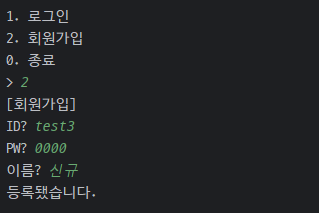
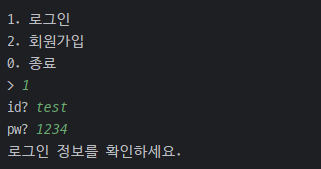

# 비트도서관


### 프로젝트 소개
- 주제 : 도서대출 CLI 프로그램
  - 비트캠프 미니프로젝트 3
- 개발기간 : 2024-07-11 ~ 2024-07-16
<!-- 이후 UI, 기능 분리 -->


### 개발팀
- (NAVER Cloud) 클라우드 기반 웹 데브옵스 프로젝트 개발자 과정 14기
- 공통 : 설계, 테스트, 리팩터링
- Backhyungi
  - Login 기능 구현
  - BookCommand, LibraryCommand 기능 구현
- chocolithm
  - Login / Menu 기능 구현
  - UserCommand, LibraryCommand 기능 구현
  - Menu에 Composite Pattern, Command에 Command Pattern 적용


### 목차
<pre>
<a href="#1">1. 시작 가이드</a>
<a href="#2">2. 기술 스택</a>
<a href="#3">3. 프로젝트 구조</a>
<a href="#4">4. 주요 기능</a>
<a href="#5">5. 화면 구성 및 기능</a>
</pre>


<!-- 
  프로젝트 로고, 배포 주소
https://velog.io/@luna7182/%EB%B0%B1%EC%97%94%EB%93%9C-%ED%94%84%EB%A1%9C%EC%A0%9D%ED%8A%B8-README-%EC%93%B0%EB%8A%94-%EB%B2%95
 -->


<br><br>
# 1. 시작 가이드 <span id="1"></span>

### Requirements
- JDK 21

### Installation
```
$ git clone "https://github.com/chocolithm/bitcamp-project3"
$ cd bitcamp-project3
```

### Run
```
$ java -cp app/bin/main bitcamp.project3.App
```

<!-- Backend, Frontend -->


<br><br>
# 2. 기술 스택 <span id="2"></span>
<!-- https://github.com/Ileriayo/markdown-badges?tab=readme-ov-file#badges -->

### Environment


### Development


### Communication

<!-- 상황에 따라 config, test, deploy 등 추가 -->


<!-- 채택한 개발 기술과 브랜치 전략 -->

<br><br>
# 3. 프로젝트 구조 <span id="3"></span>
<pre>
📦src
 ┣ 📂main
 ┃ ┣ 📂java
 ┃ ┃ ┗ 📂bitcamp
 ┃ ┃ ┃ ┣ 📂login
 ┃ ┃ ┃ ┃ ┣ 📜Login.java
 ┃ ┃ ┃ ┃ ┣ 📜LoginCommand.java
 ┃ ┃ ┃ ┃ ┗ 📜Logout.java
 ┃ ┃ ┃ ┣ 📂menu
 ┃ ┃ ┃ ┃ ┣ 📜AbstractMenu.java
 ┃ ┃ ┃ ┃ ┣ 📜Menu.java
 ┃ ┃ ┃ ┃ ┣ 📜MenuGroup.java
 ┃ ┃ ┃ ┃ ┗ 📜MenuItem.java
 ┃ ┃ ┃ ┣ 📂project3
 ┃ ┃ ┃ ┃ ┣ 📂command
 ┃ ┃ ┃ ┃ ┃ ┣ 📂book
 ┃ ┃ ┃ ┃ ┃ ┃ ┣ 📜BookAddCommand.java
 ┃ ┃ ┃ ┃ ┃ ┃ ┣ 📜BookDeleteCommand.java
 ┃ ┃ ┃ ┃ ┃ ┃ ┣ 📜BookListCommand.java
 ┃ ┃ ┃ ┃ ┃ ┃ ┗ 📜BookUpdateCommand.java
 ┃ ┃ ┃ ┃ ┃ ┣ 📂library
 ┃ ┃ ┃ ┃ ┃ ┃ ┣ 📜LibraryHandler.java
 ┃ ┃ ┃ ┃ ┃ ┃ ┣ 📜LibraryListEntireBookCommand.java
 ┃ ┃ ┃ ┃ ┃ ┃ ┣ 📜LibraryListNewBookCommand.java
 ┃ ┃ ┃ ┃ ┃ ┃ ┣ 📜LibraryReturnBookCommand.java
 ┃ ┃ ┃ ┃ ┃ ┃ ┣ 📜LibrarySearchBookCommand.java
 ┃ ┃ ┃ ┃ ┃ ┃ ┗ 📜LibraryShowGuideCommand.java
 ┃ ┃ ┃ ┃ ┃ ┣ 📂user
 ┃ ┃ ┃ ┃ ┃ ┃ ┣ 📜UserAddCommand.java
 ┃ ┃ ┃ ┃ ┃ ┃ ┣ 📜UserDeleteCommand.java
 ┃ ┃ ┃ ┃ ┃ ┃ ┣ 📜UserListCommand.java
 ┃ ┃ ┃ ┃ ┃ ┃ ┗ 📜UserUpdateCommand.java
 ┃ ┃ ┃ ┃ ┃ ┗ 📜Command.java
 ┃ ┃ ┃ ┃ ┣ 📂vo
 ┃ ┃ ┃ ┃ ┃ ┣ 📜Book.java
 ┃ ┃ ┃ ┃ ┃ ┗ 📜User.java
 ┃ ┃ ┃ ┃ ┗ 📜App.java
 ┃ ┃ ┃ ┗ 📂util
 ┃ ┃ ┃ ┃ ┣ 📜Ansi.java
 ┃ ┃ ┃ ┃ ┗ 📜Prompt.java
 ┃ ┗ 📂resources
 ┃ ┃ ┗ 📜README.md
 ┗ 📂test
 ┃ ┣ 📂java
 ┃ ┃ ┗ 📂bitcamp
 ┃ ┃ ┃ ┗ 📂project3
 ┃ ┃ ┃ ┃ ┗ 📜AppTest.java
 ┃ ┗ 📂resources
 ┃ ┃ ┗ 📜README.md
</pre>

<br><br>
# 4. 주요 기능 <span id="4"></span>

### 도서관 이용
- 도서 검색 및 대출, 반납
- 대출중인 도서에 대한 예약 기능
- 특정 월에 등록된 신간도서 목록 제공

### 관리자 기능
- 사용자 관리 및 도서 관리


<br><br>
# 5. 화면 구성 및 기능 <span id="5"></span>

<pre>
<a href="#join">회원가입</a>
<a href="#login">로그인</a>
<a href="#userMain">사용자 메인</a>
  <a href="#userMainBorrow">도서대출</a>
  <a href="#userMainReturn">도서반납</a>
  <a href="#userMainNewBook">신간도서</a>
  <a href="#userMainEntireBook">전체도서목록</a>
  <a href="#userMainGuide">이용안내</a>
<a href="#adminMain">관리자 메인</a>
  <a href="#adminMainUser">사용자관리</a>
  <a href="#adminMainBook">도서관리</a>
</pre>

### 회원가입 <span id="join"></span>
- ID 입력 시 중복 검사가 진행되고, 중복일 경우 경고 문구를 출력합니다.
- 중복 검사를 통과할 경우 비밀번호 및 이름을 입력받은 후 가입을 완료합니다.



### 로그인 <span id="login"></span>
- ID와 PW를 입력받은 후, 일치하는 사용자가 없으면 경고 문구를 출력합니다.
- 일치하는 사용자가 있으면 관리자 여부에 따라 관리자/사용자 메인으로 이동합니다.




### 사용자 메인 <span id="userMain"></span>
- 연체 중인 도서가 있을 경우, 메인화면 상단에 도서명과 연체 일자를 출력합니다.
- 번호를 통해 도서대출, 도서반납, 신간도서, 전체도서목록, 이용안내 메뉴로 이동할 수 있습니다.


### 사용자 메인 > 도서대출 <span id="userMainBorrow"></span>
- 도서 제목을 검색한 후, 대출하고자 하는 도서의 번호를 선택합니다.
- 대출가능 상태의 도서는 즉시 대출됩니다.
- 대출중인 도서는 예약 여부를 확인한 후, 희망할 시 예약 처리합니다.

 도서대출">
 도서대출 (예약)">

### 사용자 메인 > 도서반납 <span id="userMainReturn"></span>
- 현재 대출 중인 목록을 출력합니다.
- 반납할 도서 번호를 입력받아 반납 처리합니다.
- 예약된 도서일 경우, 예약자에게 즉시 대출 처리됩니다.

 도서반납">

### 사용자 메인 > 신간도서 <span id="userMainNewBook"></span>
- 특정 월을 입력받아 해당 월에 등록된 도서 목록을 출력합니다.
- 검색된 도서를 바로 대출할 수 있습니다.

 신간도서">

### 사용자 메인 > 전체도서목록 <span id="userMainEntireBook"></span>
- 현재 등록된 전체 도서 목록을 출력합니다.

 전체도서목록">

### 사용자 메인 > 이용안내 <span id="userMainGuide"></span>

 이용안내">

### 관리자 메인 <span id="adminMain"></span>
- 현재 도서관에 등록된 전체 사용자 수와 도서 수를 출력합니다.
- 번호를 통해 사용자관리, 도서관리 메뉴로 이동할 수 있습니다.


### 관리자 메인 > 사용자관리 <span id="adminMainUser"></span>
- 번호를 통해 목록, 수정, 삭제 메뉴로 이동할 수 있습니다.

 사용자관리">

[목록]
- 전체 사용자의 ID, 이름, 등록일, 대출여부를 출력합니다.
- 관리자 계정의 경우 대출여부 항목에 '관리자'를 출력합니다.

 사용자관리 > 목록">

[수정]
- 수정할 사용자의 ID를 입력받은 후, 항목을 선택합니다.
- 비밀번호 및 이름은 관리자가 직접 재설정합니다.
- 관리자여부는 현재 상태에 따라 권한을 부여하거나 회수합니다.

 사용자관리 > 수정">

[삭제]
- 삭제할 사용자의 ID를 입력하여 삭제합니다.
- 현재 로그인한 관리자 계정은 삭제가 불가합니다.
- 현재 도서를 대출 중인 사용자 계정은 삭제가 불가합니다.

 사용자관리 > 삭제">
 사용자관리 > 삭제 (본인)">
 사용자관리 > 삭제 (대출 중 사용자)">

### 관리자 메인 > 도서관리 <span id="adminMainBook"></span>
- 번호를 통해 등록, 목록, 수정, 삭제 메뉴로 이동할 수 있습니다.

 도서관리">

[등록]
- 제목, 저자, 카테고리를 입력하여 등록합니다.

 도서관리 > 등록">

[목록]
- 현재 등록된 전체 도서 목록을 출력합니다.

 도서관리 > 목록">

[수정]
- 수정할 도서의 번호 및 항목을 선택한 후 재설정합니다.

 도서관리 > 수정">

[삭제]
- 삭제할 도서의 번호를 선택하여 삭제합니다.
- 현재 사용자가 대출 중인 도서는 삭제가 불가합니다.

 도서관리 > 삭제">
 도서관리 > 삭제 (대출 중인 도서)">


<!-- 아키텍쳐 구조, 개발 일지, 회고 블로그 링크, 트러블 슈팅, 개선 목표, 후기 -->
